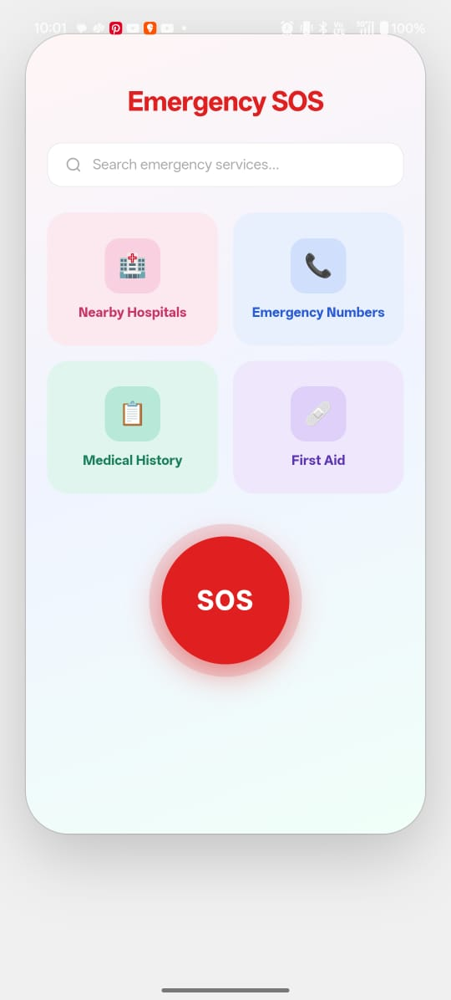
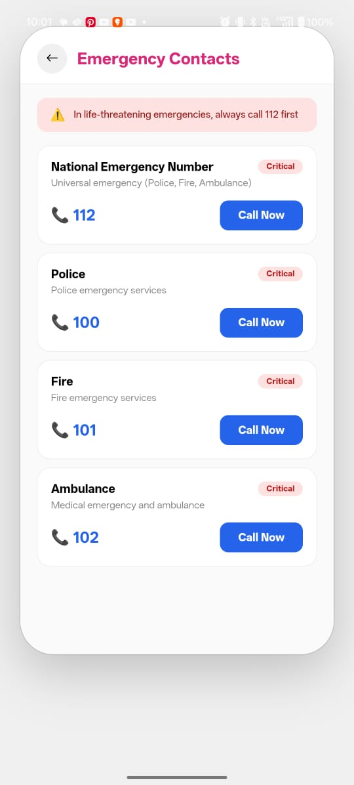
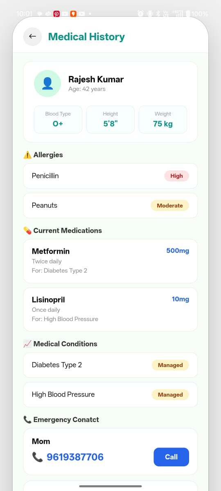
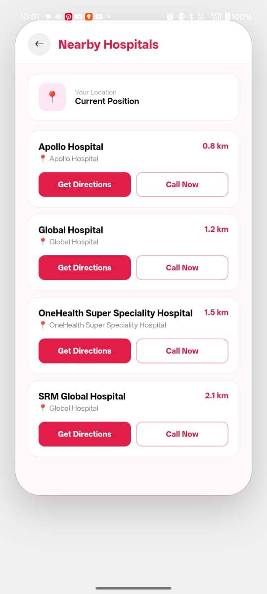
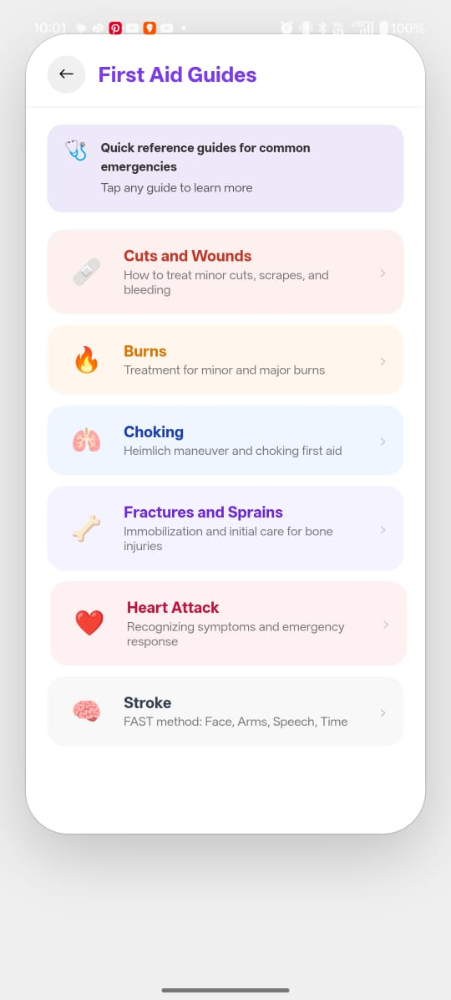

# 🚨 Decentralised Communication Platform During Disaster

A mobile-based emergency communication system designed to work even when traditional networks fail. This app enables users to send SOS alerts, contact emergency contacts, share location, and communicate using mesh networking.

---

## 📌 Features

- 🚨 One-tap SOS alert
- 📞 Multi-contact emergency calling with auto-retry
- 📍 Real-time location sharing
- 📡 Offline communication using mesh networking
- 📋 Medical history with emergency contact integration
- 🏥 Nearby hospital navigation (Google Maps)
- ⚡ Simple and user-friendly UI

---

## 🧠 How It Works

1. User presses **SOS**
2. App calls emergency contacts sequentially
3. Fetches and shares user location
4. If network fails → broadcasts SOS using mesh network
5. Nearby devices receive and forward the message

---

## 🛠️ Tech Stack

- **Frontend:** HTML, CSS, JavaScript  
- **Mobile:** Android (WebView + Kotlin)  
- **Communication:** Google Nearby Connections API  
- **Features Used:** Dialer Intent, Location Services, Bluetooth/WiFi Direct  

---

## 📡 Mesh Networking

The app uses peer-to-peer communication to send SOS messages without internet:
- Uses Bluetooth and WiFi Direct  
- Messages hop between nearby devices  
- Ensures communication even in no-network zones

---

## 📸 Screenshots

### 🏠 Home Screen

---

### 📞 Emergency Contacts

---

### 📋 Medical History

---

### 🏥 Nearby Hospitals

---

### 🩹 First Aid Section

---

## ⚠️ Limitations

- Mesh works only within short range (~100–200m per device)
- Requires nearby devices with the app installed
- Some Android restrictions limit background execution

---

## 🔮 Future Enhancements

- SMS fallback system  
- AI-based emergency detection  
- Live tracking for rescue teams  
- Cross-platform support (iOS)  

---

## 🎯 Use Case

Ideal for disaster situations like:
- Floods  
- Earthquakes  
- Network outages  

---

## 🙌 Conclusion

This project provides a reliable, decentralized communication system that ensures connectivity during emergencies, improving response time and user safety.

---

⭐ If you like this project, consider giving it a star!
